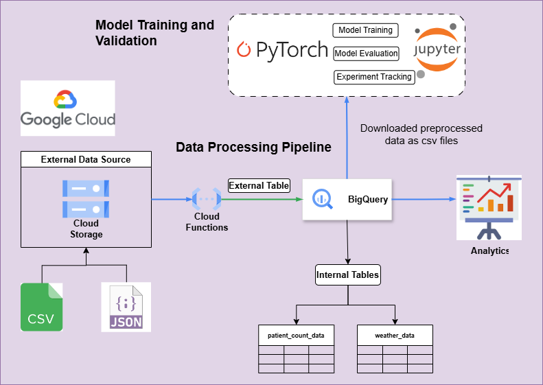
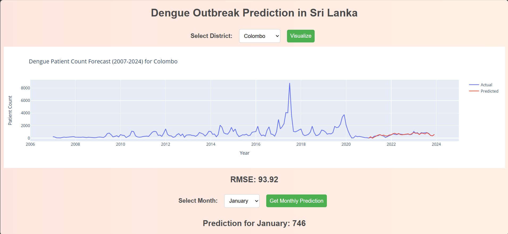

[comment]: # "This is the standard layout for the project, but you can clean this and use your own template"

# Dengue outbreak prediction in Sri Lanka using machine learning techniques

#### Team

- e18181, K.M.S.L.Konara, [email](mailto:e18181@eng.pdn.ac.lk)
- e18224, G.D.R.Mihiranga, [email](mailto:e18224@eng.pdn.ac.lk)
- e18368, H.U.Uduwanage, [email](mailto:e18368@eng.pdn.ac.lk)

#### Supervisors

- Dr. S.N.Karunarathna, [email](mailto:namal@eng.pdn.ac.lk)
- I.U.Ekanayake, [email](mailto:imeshuek@eng.pdn.ac.lk)

#### Table of content

<!-- 1. [Abstract](#abstract)
2. [Related works](#related-works)
3. [Methodology](#methodology)
4. [Experiment Setup and Implementation](#experiment-setup-and-implementation)
5. [Results and Analysis](#results-and-analysis)
4. [Conclusion](#conclusion)
5. [Publications](#publications)
6. [Links](#links) -->

1. [Abstract](#abstract)
2. [Related works](#related-works)
3. [Experiment Setup and Implementation](#experiment-setup-and-implementation)
4. [Results](#Results)
5. [Conclusion](#conclusion)
6. [Publications](#publications)
7. [Links](#links)

---

<!-- 
DELETE THIS SAMPLE before publishing to GitHub Pages !!!
This is a sample image, to show how to add images to your page. To learn more options, please refer [this](https://projects.ce.pdn.ac.lk/docs/faq/how-to-add-an-image/)
 
-->

## Abstract
This research focuses on the prediction of dengue fever outbreaks, which have become a significant public health concern in many tropical and subtropical regions worldwide. The study explores the complex and dynamic nature of the disease, considering various factors that influence its spread. By utilizing vector populations, urbanization, climate parameters, and other relevant factors, the research aims to develop effective strategies for early detection and prevention of dengue outbreaks in Sri Lanka with the aid of machine learning techniques

    

This image depicts the dengue trend in sri lanka during 1989 to 2021
    

## Related works
Here are a few related works we discovered after reviewing various research pages.

### Epidemiological Prediction Using Machine Learning
Machine learning models are increasingly utilized for epidemiological prediction, leveraging historical data to classify future dengue incidence as either high or low. Techniques like Fuzzy Association Rule Mining have been pivotal in extracting intricate relationships from diverse datasets, aiding in forecasting outbreaks in regions like Peru. Such approaches offer valuable insights for public health authorities to implement timely preventive measures.

### Climate-Based Dengue Outbreak Prediction with ML
Studies employing machine learning techniques, such as Support Vector Machines, have demonstrated the efficacy of analyzing climate variables like temperature, humidity, and rainfall in forecasting dengue outbreaks. These models provide timely information for health authorities to proactively implement preventive measures, thus mitigating the impact of dengue outbreaks.

### Temporal Dynamics Analysis for Dengue Prediction
Temporal dynamics analysis involves a multi-stage machine learning approach to dissect the temporal relationship between temperature fluctuations and dengue occurrences. By integrating auto-encoding, data representation, and temporal clustering, these models offer accurate predictions of outbreak trends over time, providing crucial insights for public health planning and resource allocation.

### Mathematical Models for Dengue Incidence Prediction
Machine learning techniques facilitate the development of mathematical models that predict dengue incidence based on weather data and population density. These models offer precise estimates of dengue cases, aiding in resource allocation and proactive public health planning.

## Experiment Setup and Implementation

### Project workflow
Our research focuses on developing a predictive model for dengue outbreaks in Sri Lanka. As our intial step, we have collected and preprocessed data from various sources, including environmental factors, historical dengue incidence rates. We have developed a data pipeline to streamline the data processing and feature extraction process, enabling us to generate comprehensive datasets for training and testing our models.

    

### Explanatory Data Analysis
In our research, we initially conducted an Exploratory
Data Analysis (EDA) to gain a deeper understanding of
the data we had previously collected.

Distribution of patient counts in Sri Lanka from 2007 to 2023 and Heatmap Correlation Matrix.
    

 The district-wise distribution of patient counts from 2007 to 2023 in
Sri Lanka.
    

### Models Selection & Training
Our project aims to leverage advanced machine learning and statistical models to predict key metrics for each district, taking into account seasonal trends, exogenous variables, and complex historical patterns. Below is a brief overview of the models we are using:

#### SARIMAX (Seasonal AutoRegressive Integrated Moving Average with eXogenous regressors)
SARIMAX is a powerful time series analysis tool that excels in handling seasonality and incorporating exogenous variables. This model helps us understand and forecast data by considering seasonal fluctuations and external influences, providing robust predictions that adapt to recurring patterns over time. After rigorous optimization, the SARIMAX model has yielded successful results, demonstrating its effectiveness in our forecasting efforts.

#### LSTM (Long Short-Term Memory)
LSTM is a type of recurrent neural network (RNN) that is highly effective at capturing long-term dependencies and temporal patterns in time series data. By utilizing its memory cells, LSTM can retain and learn from historical data, making it ideal for predicting future trends based on long sequences of past observations.

#### CNN (Convolutional Neural Network)
CNNs are well-known for their ability to identify spatial patterns in image data, but they also excel in time series analysis. By applying convolutional filters, CNNs can detect both spatial and temporal patterns, enabling us to uncover intricate structures and relationships within the data that traditional models might miss.

#### XGBOOST (Extreme Gradient Boosting)
XGBOOST is a powerful ensemble learning technique that utilizes decision trees to capture complex historical trends and environmental influences. By incorporating lagged values, XGBOOST can effectively model and predict future outcomes based on a comprehensive understanding of past behaviors and influences.

## Results
As part of our research and development efforts, we have developed an advanced interface leveraging the SARIMAX (Seasonal Autoregressive Integrated Moving Average with Exogenous Regressors) model to generate future predictions for each district.
    

This interface provides:
* Accurate Forecasting: Utilizing the SARIMAX model, our interface delivers precise and reliable forecasts based on historical data and external variables.
* User-Friendly Experience: Designed with usability in mind, the interface allows users to easily navigate and obtain predictions for their districts.
* Interactive Visualizations: The interface includes dynamic charts and graphs, making it easy to visualize trends and patterns in the forecasted data.

This tool is a significant step forward in district-level predictive analytics, providing valuable insights to aid in decision-making and strategic planning.

## Conclusion
Our project highlights the critical importance of incorporating traditional environmental factors in predicting and managing dengue outbreaks. Through the integration of genetic insights and machine learning techniques, we aim to enhance the accuracy of outbreak predictions and develop robust classification frameworks for discerning viral strains.

By adopting a multidisciplinary approach, we can significantly advance our ability to forecast and mitigate the impact of dengue outbreaks, not only in Sri Lanka but also globally. Our research underscores the necessity for further collaboration and exploration in this field to fully harness the potential of these approaches and develop targeted preventive measures.

Through the development of a predictive model that integrates environmental factors specific to Sri Lanka, we aspire to contribute to the ongoing efforts in combating dengue fever and ultimately reduce its burden on public health systems.

<!-- ## Publications -->
[//]: # "Note: Uncomment each once you uploaded the files to the repository"

<!-- 1. [Semester 7 report](./) -->
<!-- 2. [Semester 7 slides](./) -->
<!-- 3. [Semester 8 report](./) -->
<!-- 4. [Semester 8 slides](./) -->
<!-- 5. Author 1, Author 2 and Author 3 "Research paper title" (2021). [PDF](./). -->

## Links

[//]: # ( NOTE: EDIT THIS LINKS WITH YOUR REPO DETAILS )

- [Project Repository](https://github.com/cepdnaclk/e18-4yp-Dengue-outbreak-prediction-in-Sri-Lanka-using-machine-learning-techniques)
- [Project Page](https://cepdnaclk.github.io/e18-4yp-Dengue-outbreak-prediction-in-Sri-Lanka-using-machine-learning-techniques)
- [Department of Computer Engineering](http://www.ce.pdn.ac.lk/)
- [University of Peradeniya](https://eng.pdn.ac.lk/)

[//]: # "Please refer this to learn more about Markdown syntax"
[//]: # "https://github.com/adam-p/markdown-here/wiki/Markdown-Cheatsheet"
